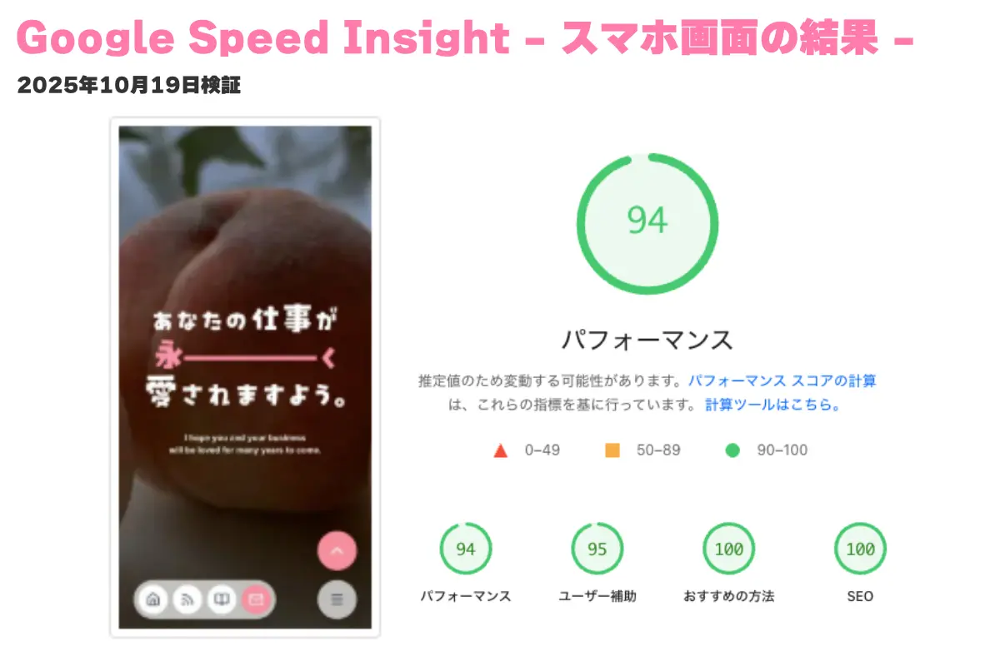

## 🍑 Peach Web Corporate Site

Next.js 15 系（App Router）と microCMS、shadcn/ui を使ったモダンなコーポレートサイトです。
関係者様へのポートフォリオのご提示のために公開しています。

<p align="center">
  
</p>

## ✈️ Demo URL

https://www.peach-web.co.jp/

## 💖 Features

コーポレートサイト制作にあたって、工夫した点などをご紹介します。

### 1. モダンな UI/UX

- スマホ画面下部に固定したナビゲボタンはアプリ風なピルデザインにしました。
- サイト内のボタンは Shadcn/ui の Button コンポーネントをカスタマイズして共通化しました。
- コンバージョンの優先度の高い「お問い合わせ」へは目立つ形でリンクを設定しております。
- トップページの新着ブログ記事はスマホで使いやすい左右スクロールにしました。

### 2. ヘッドレス CMS の連携

- microCMS の無料枠を使用して記事更新機能を追加しました。
- 記事はブログ、ピーチファイ（インタビューマガジン）、お知らせ、よくある質問を更新できます。
- 記事にはタグを付けており、よくある質問はタグによる絞り込みが可能です。

### 3. SEO 対策

- スマホでもパソコンでも Google Speed Insight で 90 以上のパフォーマンススコア達成しました。
- microCMS の記事には、内部 SEO 用のフィールドを設置しております。
- 静的/動的問わず、全てのページに構造化データ（JSON-LD）を入れております。
- Google Analytics 及び Search Console を設定しております。
- PWA 対応でスマホでも利用しやすくなっております。

### 4. 公開後のメンテナンス状況

- 2024 年秋の公開当初は Next13 系でしたが、2025 年夏に 15 系にアップデートしました。
- 2024 年秋の公開当初は Tailwind CSS 3 系でしたが、2025 年夏に 4 系にアップデートしました。
- 画面表示速度とカスタマイズ性の向上を目的に `chakraUI`をなくし、Tailwind CSS ベースの `shadcn/ui`にリプレイスしました。
- テンプレート状態では `src/lib/microcms.ts` に集中していた型定義を `src/types` ディレクトリに分離し、コードの見通しと保守性を高めました。
- component を `common`、`features`、`ui`ディレクトリに仕分けしてメンテナンス性を高めました。
- 似ているボタン系のコンポーネントを見直し、`shadcn/ui`の Button コンポーネントをカスタマイズして集約しました。
- `README.md`を作成し、公開状態を public に変更しました。

<p align="center">
  
  
</p>

## 🛠️ Tech Stack

<p align="left">
  
  
  
  
  
  
  
  
  
  
  
  
  
  
</p>

## 🚀 Setup

ローカルでこのプロジェクトを動作させるための手順をご紹介します。

1.  **リポジトリをクローン**

    ```bash
    git clone https://github.com/irifune-tatsuya/peach-web.git
    cd peach-web
    ```

2.  **依存関係をインストール**

    ```bash
    npm install
    ```

3.  **環境変数の設定**
    プロジェクトのルートに `.env.local`を作成し、以下の環境変数を設定してください。
    （`.env.example` をコピーして作ると簡単に実装できます）

    ```bash
    # .env.local
    MICROCMS_SERVICE_DOMAIN="YOUR_SERVICE_DOMAIN"
    MICROCMS_API_KEY="YOUR_API_KEY"
    NEXT_PUBLIC_BASE_URL="http://localhost:3000"
    NEXT_PUBLIC_HUBSPOT_PORTAL_ID="YOUR_PORTAL_ID"
    NEXT_PUBLIC_HUBSPOT_FORM_ID="YOUR_FORM_ID"
    NEXT_PUBLIC_HUBSPOT_START_MAIL_MAGAZINE_FORM_ID="YOUR_FORM_ID"
    NEXT_PUBLIC_HUBSPOT_STOP_MAIL_MAGAZINE_FORM_ID="YOUR_FORM_ID"
    NEXT_PUBLIC_GA_ID="YOUR_GA_ID"
    ```

4.  **開発サーバーを起動**
    ```bash
    npm run dev
    ```

`http://localhost:3000` にアクセスすることで、ローカル環境でサイトが見れるようになります。
